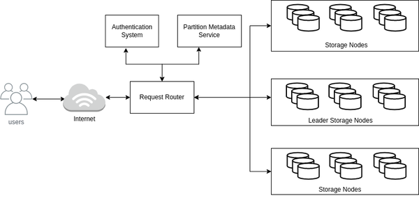

# 第七章 AWS存储服务

虽然本书的第2章和第3章阐述了多种存储类型和解决方案，但本章探讨了特定于aws的存储服务，它们映射到市场上存在的不同类型的存储解决方案。我们将从像块存储这样的传统存储服务开始深入研究，然后转向用于存储识别业务和技术需求的数据的各种数据库。

回到我们在现实生活中第9章提到的Cafe Delhi Heights的例子，Cafe Delhi Heights正在走向网上，顾客可以在那里寻找可用的食物，并从连锁餐厅订购。为了提供最佳的客户体验和在线送餐服务，Cafe Delhi Heights将在AWS存储服务上存储餐厅图像、食物菜单、营销活动信息等数据。德里高地咖啡馆给了我们这个任务。让我们深入了解如何识别他们的存储需求，并从AWS提供的服务池中选择最佳的存储解决方案。我们需要能够:

- 存储客户的配置文件和访问详细信息，如用户名和密码。
  
- 存储食物信息，如可用的菜单项。

- 存储不同类型的媒体，如餐厅食品的图片，客户上传的评论等。

- 执行大数据分析以改善客户体验，例如区分好评和差评。

- 创建食物社区，让人们在社交圈中互动。

- 基于多个标识符(如食品名称、餐厅位置、评级等)搜索食品。

- 在90天后归档应用程序日志和指标，并将它们保存一年。

---
注意

请先阅读本书的第2章和第3章来理解键存储的概念。本章建立在这些章节的基础上，深入探讨了AWS服务映射到我们在那里讨论的概念。

---

AWS存储服务使客户能够存储、保护和分析数据，而无需担心任何运营开销。我们将在两个主要部分中讨论存储服务——云存储和数据库。我们将从云存储开始，深入研究块存储、文件存储和对象存储服务。

## AWS上的云存储

AWS提供多种云存储选项:Amazon Elastic Block storage (EBS)作为块存储服务，Amazon Elastic File storage (EFS)作为文件存储服务，Amazon Simple storage service (S3)作为对象存储服务。我们在第2章中讨论了这些存储选项的一般概念，在本节中，我们将探讨为支持这些解决方案而提供的AWS服务。这些服务中的每一个都可以满足特定的存储需求，我们将在下面的部分中深入研究每种服务可以提供的好处。

### Amazon弹性块存储（EBS）

EBS是一种块存储解决方案，其作用类似于连接到个人计算机上的任何物理硬盘驱动器。类似地，Amazon EBS可以附加到一个Amazon EC2实例(在第11章中有更多关于EC2的内容)，它的生命周期独立于Amazon EC2实例，并且在本质上是灵活的，这意味着，它允许在实时生产工作负载上进行配置修改，例如:

- 动态增加大小。

- 修改发放的IOPS容量。

- 更改卷类型。

EBS卷以最小的延迟提供对存储在磁盘上的数据的访问，并且优先用于需要频繁访问磁盘的用例，例如:

- 创建和维护您自己的数据库，而不是使用AWS Cloud提供的任何服务。

- 操作系统引导卷。

对于需要临时块存储和比EBS更好的I/O性能的用例(如缓存、设备缓冲区等)，AWS提供了另一种存储解决方案，称为实例存储，它直接附加到实例上，不像EBS是网络附加存储。在磁盘故障、EC2实例状态更新以停止/休眠/终止的情况下，实例存储中的数据将被清除。实例存储不具备EBS卷那样的灵活性，比如连接到任何EC2实例、动态增加大小等。

AWS根据成本和性能等多种因素提供了广泛的EBS卷供您选择。让我们探索一下可以使用特定卷类型的场景:

*固态硬盘(SSD)*

这些卷类型包括General Purpose SSD和Provisioned IOPS SSD，它们针对事务性工作负载进行了优化。它们的主要性能属性是小I/O大小。

*硬盘驱动器(HDD)*

这些卷类型包括吞吐量优化SSD和冷HDD，它们针对大型流工作负载进行了优化。它们的主要性能属性是吞吐量。

*磁光盘*

这些卷类型主要适用于性能不是关键因素的小型工作负载。例如，不经常从存储磁盘访问数据。

以下是关于EBS卷需要考虑的几个关键点:

- 可以将多个EBS卷附加到一个EC2实例。

- EBS卷的范围在可用区级别。us-east-1a中的EBS卷不能附加到us-east-1b AZ中的EC2实例。我们可以创建EBS卷的某个时间点快照(备份)，以启用复制并确保跨AZ或区域的高可用性。

- EBS卷最初是作为非共享块存储启动的，这意味着EBS卷不能在多个EC2实例之间共享。AWS推出了Multi-Attach EBS卷功能，允许用户将单个预置IOPS SSD卷附加到同一AZ内最多16个基于氮气的EC2上，用于Linux应用程序。

- 在AZ内自动复制EBS卷，以防止任何数据丢失。

- EBS卷有一定的限制，比如AZ级别的范围和跨EC2实例的数据共享。AWS提供了另一种存储解决方案(称为AWS EFS)来克服这些限制。

EBS卷有一定的限制，比如AZ级别的范围和跨EC2实例的数据共享。AWS提供了另一种存储解决方案(称为AWS EFS)来克服这些限制。

### Amazon弹性文件存储（EFS）

Amazon EFS是一种共享文件系统，它允许在位于一个区域或内部数据中心的多台服务器之间共享存储。Amazon EFS是一个完全托管的无服务器解决方案，没有管理开销，支持所有AWS计算平台，如EC2、ECS或Lambda。不需要预先配置存储空间，价格是根据我们应用程序使用的存储空间来确定的。

Amazon EFS通常用于业务用例，如大数据分析、机器学习工作负载、内容管理等。EFS和EBS存储解决方案都为数据访问提供了较低的延迟，尽管总体性能中存在多种影响因素，例如延迟、吞吐量和每秒输入输出(IOPS)。

EFS提供多种存储类，我们可以选择最适合我们业务需求的存储类:

*EFS标准和标准-不经常访问(标准- ia)*

这两种存储类都提供了AWS区域中跨az的最高级别可用性。EFS Standard是频繁数据访问用例的最佳选择，而Standard- ia是不频繁数据访问的更好选择，也是成本最优的解决方案。对于IA存储类类型，读取或写入第一个字节的延迟更高。

*EFS One Zone和One Zone-不经常访问(EFS One Zone- ia)*

One Zone存储类不同于标准存储类的参数是可用性和您支付的成本。One Zone确保在单个AZ内的高可用性，而Standard则跨越一个区域内的多个AZ。由于这个因素，One Zone相对便宜。可以进一步使用AWS Backup以获得更好的持久性，这有助于跨三个az复制数据。

云仍然是托管业务应用程序的相对较新的技术，并且仍然存在依赖于其他文件系统(如Windows file Server)的场景。对于这样的业务用例，AWS提供了一个托管服务——amazon FSx，它可以自动扩展，没有任何操作开销。

#### Amazon FSx

我们可以利用Amazon FSx来运行流行的开源和授权文件系统，而无需担心维护或硬件设置。FSx有两种变体，我们可以根据我们的用例选择其中一种:

*Amazon FSx for Windows File Server*

它建立在Windows Server上，可以通过服务器消息块(SMB)协议从Windows、Linux或MacOS访问，以执行数据重复删除、最终用户文件存储和Microsoft Active Directory(AD)集成等业务用例。

*亚马逊FSx for Lustre*

它建立在一个流行的高性能文件系统Lustre之上。这适用于计算密集型工作负载，如机器学习、高性能计算、视频渲染等。此外，它可以与Amazon S3链接，允许从文件系统和S3 API并发地访问和处理数据。

需要一台服务器来访问EBS和EFS存储服务中的数据。Amazon S3是AWS提供的另一种无限存储解决方案，它允许用户通过公共互联网或私有AWS网络直接访问文件，而不需要中间的服务器。

### Amazon简单存储服务（S3）

AWS Cloud提供Amazon Simple Storage Service(S3)作为无限对象存储解决方案。我们可以使用S3来存储和保护各种用例的数据，例如网站、媒体存储、备份、大数据分析等。S3允许将对象存储在称为bucket的容器中。让我们介绍一些关于S3的关键概念，这些概念将有助于加深您的理解:

*桶*

桶是一个容器，由唯一的桶名标识。创建桶时需要指定桶名和AWS区域。还需要指定其他选项，例如版本控制支持。

*对象*

对象是上传到桶中的文件，它由在桶中唯一的键名标识。bucket中的对象只有一个键作为标识符。

*版本控制*

S3还允许存储同一对象的多个版本。这允许用户访问任何对象版本，并且在应用程序失败等场景中很有帮助。一个唯一的版本ID与对象的每个版本相关联。

数据存储模式因用例而异，因此S3提供了多个存储类。我们可以根据业务需求选择存储类，例如:我们需要频繁访问数据吗?或者我们是否需要一个数据存档存储?让我们深入研究一下不同的存储类。

#### Amazon S3存储类

确定您的业务用例，然后选择最适合的S3存储类，以便以最小的成本充分利用S3，这一点非常重要。根据对象访问类型和提供的冗余，S3提供的存储类如下:

*频繁访问对象*

对于延迟敏感(毫秒级)的业务用例，此存储类是首选。有两个子类基于所需的冗余支持

- S3标准——这是创建桶时的默认存储类。

- 减少冗余——与S3 Standard相比，此存储类可以用于冗余减少的非关键业务用例。AWS推荐S3存储类，而不是Reduced Redundancy，因为它也更经济有效。

*不经常访问的对象*

此存储类适用于长期存在且不经常访问的数据(如备份)。有两个子类基于所需的冗余支持

- Standard-IA—数据冗余存储在多个可用分区中，因此对象在可用分区丢失时具有弹性。

- 一个Zone-IA—数据存储在单个AZ中，因此与Standard-IA相比，它的弹性较低，这也使其相对便宜。如果数据丢失对业务并不重要，或者可以以某种方式重新创建数据，则首选此存储类。

*被归档对象*

此存储类提供低成本的数据归档支持，并具有类似于S3标准存储类的弹性。根据数据检索的需要，有三个子类

- S3 Glacier即时检索-这对于需要毫秒检索的很少访问的数据非常有用。如果将此存储类与Standard-IA进行比较，则存储成本更低，数据访问成本更高。

- S3冰川灵活检索-这是有用的数据访问在几分钟(1-5分钟)。它要求至少90天的存储时间，因此即使在90天之前删除或迁移数据，也将按90天计算成本。

- S3 Glacier Deep Dive—此存储类成本最低，最低存储时间为180天，默认检索时间为12小时。您还可以使用批量检索选项，在48小时内检索数据。

考虑一个场景，该场景要求在30天内频繁访问数据，在30天之后不频繁访问数据。这样的用例可以通过S3生命周期配置来满足——这些配置是应用于桶对象的规则。你需要在这些配置中定义两种类型的操作:

*转换操作*

定义对象到另一个存储类的转换，例如30天后将对象从Standard移动到Standard- ia存储类。

*过期的行为*

定义对象过期。S3将根据配置的规则在对象过期后自动删除它们。

S3可选地提供了智能分层支持，因此数据可以自动移动到不同的存储类，而无需任何操作开销。在这里，我们列出了要移动到不同存储类的对象的生命周期:

*频繁的访问*

上传或迁移到S3智能分级的对象存储在“频繁访问”层。

*频繁的访问*

如果对象连续30天未被访问，则将其移动到不频繁访问层。

*档案即时存取*

如果对象连续90天未被访问，则将其移动到Archive Instant Access层。S3根据数据访问的时间段提供了两个可选的归档访问层。如果激活，如果数据至少连续90天未被访问，则移动到“归档访问”中;如果数据至少连续180天未被访问，则移动到“深度归档访问”中。

存储类有助于根据访问模式或所需的冗余支持将数据存储到S3。另一个需要考虑的因素是将对象存储到S3时的数据安全性。下一节将探讨S3提供的保护数据的不同选项。

#### Amazon S3数据安全

S3桶中的对象默认情况下可以被桶的所有者访问。S3提供了不同的机制来保护数据和配置S3桶和对象的访问权限。

*加密*

默认情况下，S3使用服务器端加密(SSE-S3)加密所有对象，除非选择了不同的加密选项，例如使用称为SSE-KMS的AWS密钥管理服务(KMS)。此外，您还可以配置客户端加密以提高安全性。

*对象锁*

对象锁可以在有版本的桶上启用。一旦启用，对象将使用write-once-read-many (WORM)模型存储，这可能是组织的监管要求。对象锁为对象更改提供了额外的保护层，并有助于防止对象在固定保留期或无限期(称为合法持有)内删除或覆盖。

*封锁公众通道*

此选项对于管理和设置对存储桶的公共访问的集中控制非常有用。此配置也可以在帐户级别上应用，以便在AWS帐户中的所有S3桶中反映。一般来说，除非有特定的业务需求，例如具有可公开访问的媒体文件的bucket，否则将bucket公开并不是一个好主意。我们可以使用S3的Access Analyzer来识别授予公共访问权限的存储桶。

*IAM Policy*

IAM Policy有助于授予用户或组对S3资源的读写访问权限。

*Amazon Macie*

Amazon Macie有助于识别和保护存储在S3存储桶中的敏感数据，比如信用卡号。它还有助于评估桶级访问控制(类似于S3 access Analyzer)，比如公共访问的桶。

*ACLs*

S3 ACLs作为子资源附加到S3桶或对象上，有助于管理对其他用户的访问。默认情况下，ACLs是禁用的，建议保持这种状态，除非需要单独控制每个对象的访问。我们可以依靠策略来进行访问控制，而不是ACLs。

*桶的政策*

桶策略有助于管理S3桶及其中对象的访问权限。例如，它可以允许帐户A从帐户b拥有的S3桶中读取对象。下面是S3桶策略的几个示例。桶策略的大小限制为20kb。

我们介绍了不同的服务，这些服务允许你用云存储存储数据，并像在个人电脑上使用存储一样处理数据。接下来，我们将讨论AWS提供的数据库服务。您应该已经从第2章的关系数据库和第3章的非关系数据库中了解了数据是如何存储在数据库中的，所以现在我们将深入研究AWS的细节。

## AWS数据库

### Amazon RDS

#### Amazon Aurora

Amazon Aurora比MySQL快5倍，比PostgreSQL快3倍，在相同的硬件上运行，它可以根据应用程序的需要自动扩展。Aurora为你的数据创建了六个副本，分布在3个az上，并持续地将其备份到S3。Aurora还提供跨多个区域复制数据的功能，以实现更快的全球访问。此外，当我们不需要保持DB实例一直运行时，我们可以将Aurora Serverless用于不可预测的工作负载或用于开发目的。

以下是关于Aurora的几个关键考虑因素：

- 不需要像rds那样配置存储需求——它由Aurora内部处理。

- Aurora Serverless基于最小和最大Aurora容量单元运行，而不是像RDS这样的实例类型。

- RDS工作在VPC级别。经典的RDS可以向公共互联网开放，也可以限制为允许特定的ip从外部访问它。使用Aurora Serverless，您不能提供公共访问，但您可以使用Data API或利用与Aurora相同VPC中的EC2机器来促进连接。

- 为了数据安全或满足静态数据加密的遵从性需求，Amazon RDS和Aurora都提供了加密DB实例的功能。

当您的业务需求需要支持完全符合ACID属性的关系结构化数据时，Amazon RDS是一项有益的服务。许多现代应用程序不需要强ACID遵从性、完整的关系支持或固定的模式。Amazon NoSQL数据库是解决这类用例的可行解决方案，同时还提供可伸缩性、高性能和无操作开销。我们在第3章中描述了多种类型的NoSQL数据库，在本章中，我们将介绍AWS为不同类型的NoSQL数据库提供的等效服务，从Amazon DynamoDB作为键值数据库解决方案开始。

### Amazon DynamoDB

AWS提供Amazon DynamoDB (DDB)作为键值数据库产品，旨在为任何工作负载规模提供一位数的毫秒延迟。DDB将数据存储在表中，并遵循无模式设计。在第3章中，我们讨论了使用键值数据存储来唯一标识项的主键、分区键和排序键。在DDB体系结构中，主键由分区键或分区键和排序键的组合表示。任何数据查询都可以通过您首选语言的AWS命令行界面(CLI)、AWS控制台或AWS软件开发工具包(SDK)执行。DDB基于leader-follower节点模型，并在内部将数据存储在称为分区的存储节点上。

下面是负责在DDB上存储数据的键:

*分区键*

分区键是在创建表时强制指定的，它被用作内部哈希函数的输入，以确定应该存储数据的物理分区。RR (Request Router)组件负责将请求路由到特定的分区，如图7-1所示。RR是一种无状态服务，它咨询Partition Metadata service来确定分区，然后将请求转发到特定的分区。PUT请求被发送到领导节点，而GET请求可以通过领导或跟随节点提供，具体取决于所需的一致性支持。

*排序关键字*

Sort Key是创建表时的可选属性。如果指定了主键，则主键是分区键和排序键的组合，否则就是分区键。分区键和排序键的组合对于数据存储来说应该是唯一的。具有相同分区键的所有项按照排序键值的顺序存储在同一物理分区上。我们建议根据读/写查询模式创建包含分区键和排序键的DDB表，这样就可以在不需要全局辅助索引(Global Secondary Indexes, gsi)的情况下满足用户请求。



图7-1 DynamoDB内部架构

DDB是一个完全托管的服务，我们不需要配置任何服务器或存储空间来使用它，相反，我们可以从不同的容量模式中选择每个特定表允许的读写。DDB将读和写分别定义为读容量单位(RCU)和写容量单位(WCU)，定价基于消耗的RCU和WCU，以及所需的一致性或事务支持。让我们了解可用的DDB容量模式:

*供应*

预置意味着客户可以为要支持的表配置特定的RCU和WCU值，DDB内部管理资源来支持这种规模。当你可以很容易地预测RCU和WCU需求时，这是具有可预测流量的应用程序的首选模式。

*自动伸缩*

对于具有不可确定的固定配置容量的不同工作负载，我们可以使用AutoScaling模式，设置RCU和WCU的上限和下限，并且DDB会根据流量自动向上或向下扩展。

*按需应变*

DDB On-demand是一种无服务器支持，我们不需要配置RCU和WCU值。DDB在后端管理规模，我们作为客户不必担心它。对于具有未知工作负载或不可预测应用程序流量的表等用例，这是首选模式。

DDB表可能负责为多个用例提供服务，并不是所有用例都只使用主键设计就能实现性能。DDB提供索引支持以使查询更快，并且可以根据需要在表的顶部创建索引。我们可以将DDB索引看作是通过从主表中选择一些属性创建的子表。DDB支持两种类型的索引，LSI (Local Secondary Index)和GSI (Global Secondary Index)，如表10-1所示。

|参数|LSI|GSI|
|---|---|---|
|生命周期|LSI的生命周期与表中相同。它只能与表的创建/删除一起被创建/删除。|GSI生命周期独立于表，可以根据需要创建/删除。
|主键模式|分区键与基表相同，只是排序键不同。|分区键和排序键可以不同于基表。
|查询能力|范围限定在基表的分区内，因此使用术语“本地”，索引数据大小限制为10 GB。|查询可以跨越基表数据上的分区，因此术语“全局”没有大小限制。
|provision capacity| lsi与基表共享的读写吞吐量。|GSI对来自基表的读/写吞吐量有独立的设置。
|读一致性|提供强读一致性和最终读一致性。|只提供最终的读一致性。

当我们从传统的关系数据库转移到各种各样的现代NoSQL数据库时，一个关键的区别是事务支持。事务本身在SQL类数据库中是可用的，但并不是所有的NoSQL数据库都支持事务。DDB提供事务支持，如果我们的用例对事务有需求，我们可以选择特定的读写api。另一个区别是强一致性支持——ddb提供最终一致性和强一致性支持(尽管GSI只支持最终一致性)，并且我们可以在访问数据时指定所需的支持类型。

我们讨论了基于分区键和不同容量模式的物理分区识别，这有助于我们配置DDB表的读写吞吐量。吞吐量值应用于整个表，并在正在创建的分区之间平均分配。分区有3000 RCU和1000 WCU的硬限制，一旦超过这个限制，请求就会被限制。为了避免这种请求限制(也称为热键)，我们应该仔细设计模式，理解查询模式并牢记DDB体系结构。让我们转到一个名为Amazon DocumentDB的文档数据库产品。

### Amazon DocumentDB

Amazon DocumentDB是一个由AWS提供的文档数据库，旨在将数据存储和查询为类似json的文档。文档的结构是嵌套的键值对的集合，在存储食物菜单信息(比如Cafe Delhi Heights的在线商店)等场景中非常有用。我们已经为下面的客户订单添加了一个示例文档。我们可以轻松地向食物菜单项添加或删除属性，而不必担心关系数据库等固定模式。其他一些业务用例包括内容管理、实时大数据和维护用户配置文件。

```json
{
  "Name": "Mandeep Singh",
  "orderId": "1234-1234-4567",
  "FoodItems": [
    {
      "itemName": "Biryani",
      "qty": 1
    },
    {
      "itemName": "Nuggets",
      "qty": 2
    }
  ]
}

```

作为参考，表10-2阐明了与DocumentDB相关的术语如何与关系数据库相比较。

表7-2 SQL vs DocumentDB 术语
|||
|---|---|
|SQL|MongoDB/DocumentDB|
|表|collection|
|行|文件|
|列|字段|
|主键|对象id|

Amazon DocumentDB与MongoDB兼容，支持强大的临时查询，并提供与DDB类似的事务支持。与MongoDB相比，DocumentDB在功能上也有一些优势，比如对所有CRUD语句的事务支持，包括对多个文档的操作。关于MongoDB和DocumentDB之间的所有功能差异，请参考AWS文档。与DDB不同，我们需要为DocumentDB集群设置指定实例类和实例数量。对于生产系统，我们建议选择至少三个实例以获得更高的可用性。最后一步是为身份验证设置用户名和密码，并建立与DocumentDB集群的连接。

AWS还提供了迁移工具，如AWS数据库迁移服务(DMS)，以便更轻松地将MongoDB工作负载从本地或EC2服务器迁移到DocumentDB。存储业务用例可能会有所不同，对于需要图形数据库的用例，我们可以利用Amazon Neptune。

### Amazon Neptune

### Amazon ElasticCache

### Amazon Opensearch

### Amazon Timestream

Amazon Timestream是一个完全托管的无服务器数据库服务，提供给需要时间序列数据操作的用例，比如DevOps分析数据。Amazon Timestream可以自动扩展到每天处理数万亿事件，与关系数据库相比，成本仅为1/10，但速度快了1000倍。

以下是Amazon Timestream数据库需要考虑的几个要点:

- 由于TimeSeries DB是无服务器的，所以它很容易使用，不需要分析实例的数量或类型。

- TimeSeries DB提供内置的分析支持插值和平滑功能，用于使用标准SQL识别趋势、模式和异常。

- 默认情况下，数据使用标准密钥或客户拥有的KMS密钥进行加密。

- TimeSeries支持基于配置时间的数据保留策略，并根据策略将数据移动到不同的存储层。它支持两个存储层——内存层(优先用于延迟敏感查询)和磁盘层(优先用于分析查询)。

- 记录需要时间戳作为强制维度，并且存储到DB中的数据不能被删除或更新。数据的删除应该通过保留策略的配置来处理。

我们在第3章讨论了宽列数据库的概念，然后讨论了一个开源版本，称为Apache Cassandra。让我们讨论一下满足类似需求的AWS托管解决方案Amazon Keyspaces。

### Amazon Keyspaces

Amazon Keyspaces是一个高度可伸缩、可用和可管理的宽列数据库服务(我们在第3章中介绍过)，与开源Apache Cassandra数据库兼容。Amazon Keyspaces是作为无服务器服务提供的，这意味着我们不必担心资源配置，可以简单地专注于构建应用程序。可以考虑使用Amazon Keyspaces的一些用例是:

- 将本地Cassandra集群或运行在EC2实例上的集群迁移到完全托管的AWS服务。这有助于减少大型集群管理开销，如管理部署、为工作负载找出最佳配置(如JVM垃圾收集调优)、了解Cassandra内部机制、为预期工作负载提供容量、更新版本升级、打补丁和维护集群基础设施等。

- 您有与开源Cassandra兼容的业务需求。

- 与客户自己管理相比，Amazon Keyspaces与AWS服务(如用于监控目的的Cloudwatch或用于身份验证的IAM)有更好的集成。

现在，由于Amazon Keyspaces抽象出了基础设施管理，我们无法访问低级集群管理控制平面api。Amazon Keyspaces为表的读写工作负载提供了两种类型的容量模式，类似于DDB:具有自动伸缩功能的预置容量和按需容量。默认情况下，Keyspaces表中的所有数据都在多个az中进行加密和复制，以实现高可用性和持久性。请参考AWS指南了解Cassandra和Amazon Keyspaces之间的功能差异。

## 结论

我们讨论了AWS提供的各种存储服务，这些服务可用于满足我们的业务需求。云存储部分重点介绍了基本存储选项，如块存储、文件存储和对象存储，而数据库部分则介绍了为关系和非关系数据库提供的AWS服务。了解业务用例对于选择成本最优的存储服务非常重要。为此，让我们再看看德里高地咖啡馆的存储要求。可使用的AWS存储服务如表10-2所示。

表7-3  Cafe Delhi Heights的仓储服务标识
|||
|---|---|
|需求|存储服务|
|存储客户的个人资料和访问详细信息，如用户名和密码|RDS, Aurora, ElasticCache|
|存储食物信息，例如可用的菜单项|DDB, DocumentDB, Keyspaces, OpenSearch|
|存储不同类型的媒体，如餐厅食品的图片，客户上传的评论等。|S3|
|大数据分析改善客户体验，比如区分好评和差评。|S3, EFS, DDB|
|创建食物社区，让人们在社交圈中互动。|Neptune|
|基于多个标识符(如食品名称、餐厅位置、评级等)搜索食品。|OpenSearch
|应用程序日志和指标在90天后归档，并持续一年。|S3, OpenSearch|
|||

---
注意

请参考第2章和第3章，了解基于您的业务用例选择存储解决方案的一般指导方针和流程图。

---

为了处理客户端请求或处理存储在AWS存储服务上的数据，我们需要服务器或计算平台。在下一章中，我们将讨论并深入探讨AWS提供的不同类型的计算平台，以及如何为我们的业务用例确定最佳选择。
