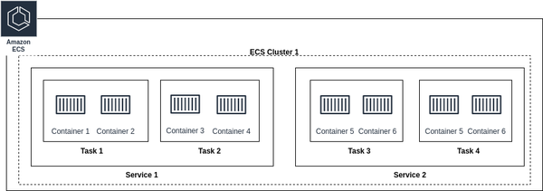

# 第十一章 AWS计算服务

你喜欢编程，把空闲时间花在个人电脑上设计和创建新的软件应用程序上。您最近创建了一个将输入图像转换为卡通图像的应用程序，并将其演示给您的朋友，他恰好是一家大型科技公司的软件工程师。这位朋友非常喜欢这个想法，并建议与其他人分享这个应用程序——而且它还可以帮助你赚一些额外的钱。但是如何才能完成这个任务呢?如何使在个人计算机上运行的程序可供其他人访问?

对于这个特定的示例，您需要某种机制，允许人们将图像发送到个人计算机，然后个人计算机通过internet返回作为卡通图像的输出。这里，在这个场景中，个人计算机充当服务器。服务器只不过是一台大部分时间都在运行的计算机(即一个高可用性的应用程序)，负责服务任何类型的请求。该服务器可以仅供您或任何其他计算机或其他用户访问，这些用户都被称为客户端。

服务器是任何应用程序的重要组成部分，AWS提供多个计算平台来运行应用程序。AWS云中的计算平台是托管在AWS数据中心的虚拟服务器，可以通过互联网访问。我们将从一个类似于我们的个人计算机的计算平台开始讨论，称为Amazon Elastic compute Cloud (EC2)机器，然后转向AWS Lambda和AWS Cloud中的容器化服务。

## Amazon弹性计算云

Amazon EC2是由AWS提供的可扩展虚拟服务器托管服务。我们可以利用Amazon EC2服务在AWS云中创建虚拟机，这些虚拟机具有所需的一组配置，如CPU、内存、存储、网络等。这些虚拟机或虚拟计算环境称为实例。AWS提供了选择裸机服务器或使用通过管理程序维护的虚拟化环境的选项，这应该通过确定您的业务和遵从性需求来确定。以下是关于管理程序和裸机服务器的一般描述:

*虚拟机监控程序*

虚拟化组件用于在单个物理服务器上运行多个虚拟机，如图8-1所示。Hypervisor帮助将CPU和内存等计算资源分配给运行自己的操作系统和应用程序的虚拟机。AWS基于可用的实例类型支持两种管理程序——Xen和Nitro。Nitro系统是新一代的管理程序，具有更高的安全性和性能。

*裸机服务器*

裸机服务器是专用于单个租户的物理服务器。对于需要直接访问Intel至强处理器基础设施(如Intel jt -x)、有严格的遵从性要求或需要运行自己的定制管理程序的工作负载，它们很有帮助。例如，运行Oracle hypervisor而不是Nitro。

---
注意

一个Amazon EC2实例不一定映射到AWS云中的一个物理服务器。

---


图 11-1 Xen Hypervisor

在AWS Cloud中启动和运行实例很容易，并且消除了维护物理硬件的麻烦。按照AWS页面上的步骤，只需在AWS控制台上单击几下即可启动Amazon EC2实例。实例是用Amazon Machine Image (AMI)确定的一组特定配置启动的。

### Amazon机器镜像

我们用不同的配置启动一个Amazon EC2实例，例如:启动实例时使用的操作系统;附加到实例的存储卷;在启动实例之前安装依赖项、自定义安全配置等。这些配置可以通过预先配置的模板(称为Amazon Machine Image (AMI))来定义，该模板可以轻松高效地提供具有所需软件堆栈的EC2实例。考虑这样一个场景:作为一名工程师，您负责为组织中启动的所有EC2实例安装安全依赖项。一种方法是在这些EC2实例启动后在它们上运行脚本，但更优的方法可能是创建一个基本AMI，并安装所有必需的依赖项。这从本质上节省了大量时间，并确保了100%的信心，没有遗漏所需依赖项的EC2实例。

作为客户，我们可以使用AWS社区免费提供的ami启动EC2实例，也可以从红帽(Red Hat)等第三方购买ami，或者根据我们的需要创建自己的定制ami。例如，Amazon Linux和Amazon Linux 2 ami是免费的，并且完全由AWS支持和维护。AWS提供了一个市场，用户可以从各种公开可用的ami中进行选择。以下是为您的业务用例选择最佳AMI的一些考虑事项:

*地区*

ami是针对区域创建的。如果AMI在特定区域中不可用，您可以将AMI复制到所需的区域，并进一步使用它来启动EC2实例。

*操作系统及架构*

EC2实例在操作系统上运行，您可以选择AWS支持的多种操作系统(32位或64位体系结构)。

*发布权限*

AMI可以由AWS、企业或个人拥有。根据所有权，AMI可以对公众、一组用户或单个人可用。

*根设备存储*

ami可以由Amazon EBS或Instance Store(参见第9章存储服务了解更多细节)作为根设备存储提供支持。根设备存储包含用于引导EC2实例的映像。这两种存储选择存在显著差异，例如大小限制(io2 EBS Block Express为64 TB，实例存储为10 GB)、数据持久性、引导时间(通常EBS少于1分钟，instance store少于5分钟)等。

---
注意

您可以在这里查看有关Amazon EC2实例根设备存储的完整详细信息。
---

在为EC2实例确定AMI之后，我们需要做出的下一个决定是实例类型。AWS根据不同的功能提供了广泛的实例类型，我们可以选择最适合我们需求的。

### 实例类型

硬件需求因客户而异，考虑到这一点，EC2服务提供了不同的实例类型。AWS EC2中的实例类型定义了EC2实例的硬件和性能特征。对于哪种实例类型最合适，我们可能并不总是有一个具体的答案，在这些情况下，我们可以首先在任何通用实例上安装应用程序，然后执行负载测试。这个方向将有助于确定这个特定实例的极限，并最终帮助确定工作负载所需的实例类型和实例数量。

不同的实例类型提供CPU、内存、存储和网络容量的不同组合。以下是AWS Cloud中可用的不同实例类型家族:

*通用实例*

通用实例适用于行业中的大多数工作负载，它们在计算、内存和网络资源之间保持良好的平衡。

*计算优化实例*

计算优化实例适用于高性能计算、大数据分析等CPU密集型工作负载。

*内存优化*

内存优化实例适用于需要在RAM(如内存缓存)中处理大型数据集的工作负载。

*存储优化*

存储优化实例适用于需要对本地存储(如数据库)上的大型数据集进行高顺序读写访问的工作负载。

*加速计算实例*

加速计算实例是基于gpu的实例，适用于需要高性能计算、计算金融、机器学习等工作负载。

选择合适的实例类型对于实现特定工作负载的最佳性能和成本效益至关重要。有关实例类型和实例族的最新指导，请参阅Amazon EC2实例类型上的AWS页面。在启动EC2实例时，还有一些额外的关键考虑事项:

- 要在实例启动后与它建立连接，您应该选择一个密钥对来启用对实例的安全外壳(SSH)访问。
- EC2实例在特定区域内的AZ级别启动。EC2允许修改默认的网络配置，如启动的VPC实例、VPC中的子网、安全组等。这些配置有助于确定如何建立与已启动实例的连接。
- 我们可以选择将公共IP分配给实例。公共IP分配有助于直接从公共互联网连接到实例，因为我们通过安全组或acl拥有适当的权限。

---
注意

对于生产环境，我们建议使用AWS CloudFormation或任何其他工具通过代码而不是AWS控制台启动基础设施。这将有助于在任何其他所需区域或AWS帐户中更好地可维护性和复制基础设施。

---

为了大规模运行应用程序，我们需要在整个基础设施中的多个实例的垂直扩展和水平扩展之间取得良好的平衡。通过查看使用指标，我们可以计算出在较长时间内所需的最小实例数量。对于这样的场景，可以通过使用预留的EC2实例容量来降低成本，与基于使用承诺(一年或三年承诺)的按需实例定价相比，可以获得高达72%的折扣。请注意，按需实例是我们根据需要从AWS控制台启动的实例，而对于保留实例，我们会在一段时间内预提交使用EC2实例。

与保留实例相反，在某些用例中，我们不太担心在工作负载运行时丢失实例，或者一旦实例在EC2池中可用，就可以稍后恢复工作负载。对于这样的场景，我们可以利用称为Spot实例的东西。Spot实例比On-Demand实例更便宜。举个例子，假设us-east-1a AZ的总容量为100m4。大的实例。在这100台机器中，有一半已经被客户使用。此外，根据AWS的历史分析，客户很快就会请求30个实例作为专用容量。在这个由100个实例组成的EC2池中，还剩下20个这样的实例，AWS和客户都无法从中受益。因此，这些实例可以以较低的成本作为现货实例提供给客户。对于需要超过30个的AWS客户这样的场景，可以关闭任意一个现货实例并将其分配给提出请求的客户。

在EC2实例上运行的应用程序的流量每天都在变化，我们可能并不总是需要固定数量的EC2实例。AWS提供了自动缩放功能，可以帮助您自动添加和删除应用程序的实例。例如，应用程序在中午需要10个实例，而在午夜只需要2个实例。让我们接下来深入探讨。

### 自动伸缩

自动扩展是一项AWS功能，它可以自动调整集合中EC2实例的数量，以响应不断变化的工作负载需求。我们可以基于任何因素(如可用分区、实例类型等)创建EC2实例集合，当在这些集合上启用自动伸缩功能时，这些集合被称为自动伸缩组(Auto Scaling groups, ASG)。在这些组中，我们可以指定最小和最大实例数量，并应用自动缩放策略，以便在此限制内自动添加和删除实例。它可以根据预定义的扩展策略动态地向上或向下扩展容量，从而帮助维护应用程序性能和可用性。可以将自动缩放配置为根据CPU利用率、网络流量或用户定义的自定义度量等指标进行缩放。它确保应用程序无缝扩展以处理增加的流量，并在低需求期间降低成本。如图8-2所示，ASG的累积CPU利用率超过了限制，增加了一个新的实例。

- 对于Auto Scaling Group 1，配置的最小实例数为1，最大值为4。

- 假设自动扩展策略的状态为，如果连续5分钟最大CPU利用率超过75%，则向组中添加一个新实例。

- 现在，当超出限制时，自动扩展将启动，所需的实例数量从1变为2，并启动一个新的EC2实例。


图8-2 自动伸缩

AWS云中的大型应用程序可能会运行数千台EC2机器来服务客户流量或内部系统处理，并且必然会发生故障。EC2实例可能由于不可预见的硬件故障而停机，作为客户，我们应该有适当的机制来克服这些故障。有多种方法可以处理这些问题，例如:

- 自动缩放策略，以始终维护组内所需的实例数量。

- 在多个AZ中启动EC2实例，以抵御AZ故障。

- EC2自动恢复是在发生故障时重新启动实例的一种机制。使用相同的配置重新启动实例，例如实例Id、元数据、附加的EBS卷、私有IP和弹性IP地址。

EC2是在AWS云中运行应用程序的最古老和最广泛使用的服务。EC2提供了维护软件堆栈的控制和硬件操作的最大可见性。但是，了解应用程序软件的部署方式可能并不总是必需的，或者您可能希望避免系统的任何操作维护，例如操作系统补丁。对于这些场景，AWS提供无服务器服务，客户无需担心实例供应或容量规划。无服务器，顾名思义，抽象出服务器细节，并直接允许我们运行工作负载。AWS Lambda运行在无服务器模型上，允许以所需的规模执行代码。接下来让我们深入了解AWS Lambda。

## AWS Lambda

AWS Lambda是一个完全托管的无服务器计算服务，允许用户运行代码而无需服务器维护开销。为了在AWS Lambda上运行我们的应用程序，我们唯一需要的是我们首选语言的代码，称为Lambda函数。它支持多种编程语言，支持快速开发和部署事件驱动的应用程序。Lambda的后端架构是按函数运行时提供的，并在客户调用事件上执行。Lambda自动扩展底层基础设施以匹配工作负载，从而提供高可用性和可靠性。以下是您需要了解的与AWS Lambda服务相关的主要概念:

*函数*

函数是使用AWS Lambda支持的首选编程语言的应用程序代码库，并在触发器的帮助下调用以执行特定逻辑。

*触发*

触发器是负责调用Lambda函数的任何资源或配置，例如，通过AWS控制台或通过任何AWS服务(如Simple Queue Service(SQS)、DDB流、Kinesis等)进行调用。

*事件*

Event是自定义json格式的文档或特定于AWS服务的任何其他结构，例如SNS通知，用于将信息传递给Lambda函数进行处理。

*Lambda执行环境*

Lambda后端基础设施在内部为函数执行创建一个安全且隔离的运行时环境。这个运行时环境被称为执行环境，它是在用户输入的帮助下设置的，比如函数语言运行时、可用内存和函数的最大执行时间(支持的最大配置是15分钟)。lambda执行随着执行时间的流逝而关闭。执行环境以特定的指令集体系结构启动，Lambda提供两种类型的体系结构来确定计算机处理器类型:

- 采用64位ARM架构的AWS gravon2处理器。

- X86_64, 64位x86架构，用于基于x86的处理器。我们建议使用arm64架构，以提高x86的成本和性能效率。

*部署包*

Lambda函数代码可以通过部署包以以下两种方式部署:

- 包含代码及其依赖项的.zip文件存储在Amazon S3中，最大允许大小为250MB。Lambda负责为函数提供操作系统和运行时。

- 存储在Amazon Elastic container Registry (ECR)中的容器映像，其中包含代码及其依赖项，最大允许大小为10GB。映像应该与Open Container Initiative兼容，并且应该包含操作系统和运行时。

*层*

像实用程序或库这样的公共代码可以压缩成层，而不是将它们添加到每个Lambda函数中。层可以附加到Lambda并有助于代码共享，从而减少Lambda函数代码包的总体大小和启动时间。层还支持版本控制，以维护代码库的多个版本并确保向后兼容性。

*Destination*

Destination是另一个被配置为在异步Lambda执行完成(成功/失败)时接收调用记录的AWS服务。AWS支持标准SQS队列、标准SNS主题、Lambda函数和EventBridge事件总线作为目的地。

---
注意

AWS不断添加新的语言运行时，请在此处查看有关支持的语言运行时的最新指导。

---

调用Lambda函数进行处理的方式取决于您的用例——一些选项包括将对象添加到S3 bucket或通过Cloudwatch事件每周安排一次。您可以根据您的用例为lambda调用选择一个特定的触发器。Lambda支持三种类型的调用模式——同步、异步或基于轮询的调用:

*同步调用*

同步调用可以通过多种方式实现——通过API网关、应用程序负载平衡器、AWS CLI等。在此调用模式中，客户等待响应，直到Lambda完成其执行。对于延迟敏感的工作负载，执行超时时间不超过15分钟。如果Lambda是通过任何AWS服务触发的，则执行超时也可以更短，例如API网关的执行超时为29秒。

*异步调用*

异步调用可以通过S3、Simple Notification Service(SNS)、CloudWatch事件等实现。在此调用模式中，立即返回响应，Lambda将请求排队等待处理。还可以将其配置为处理重试并将调用响应直接指向已配置的目的地，这与调用的同步模式不同。

*轮询调用*

这是基于流或队列的服务(如DDB流、Kinesis、SQS队列或Kafka)的首选模式。在这种调用模式中，Lambda负责轮询AWS服务并同步调用Lambda函数进行处理。好的方面是AWS不向客户收取消息轮询费用，我们只为Lambda函数调用付费。重试机制取决于AWS服务中的数据过期时间，例如SQS队列的过期时间从1分钟到14天不等。

我们提到了调用时的Lambda供应资源，由于冷启动问题，这可能导致更多的请求处理时间。冷启动是指Lambda提供资源和准备执行环境所需的时间，该环境涉及从S3或ECR下载的功能代码，创建具有内存和运行时配置的环境，以及从主功能代码中执行任何初始化代码。完成设置后，Lambda开始为客户请求提供服务。根据AWS对生产工作负载的分析，冷启动时间从100毫秒到1秒不等，通常占总调用的1%。AWS推荐多种方法来减少冷启动问题，如下所述:

*温暖的开始*

函数完成执行后，执行环境不会立即删除，而是保留一段时间，以便为调用相同Lambda函数的连续请求提供服务。这可以确保跳过每个Lambda调用的执行时间设置，称为热启动。冷启动并不掌握在客户手中，Lambda可以根据需要创建执行环境。例如，Lambda为并发调用创建了一个新的执行环境，以处理不断增加的流量。

我们可以利用热启动，在Lambda函数为实际请求提供服务之前有意地用虚拟输入调用它。此方法仅推荐用于计划的或低流量的工作负载，而不适用于大规模操作的生产环境。

*提供并发性*

预置的并发确保预先设置好执行环境，以便为请求提供服务。例如，预置并发性为4的Lambda函数将并行创建4个执行环境，它对于具有大型初始化代码库的函数非常有用。

*内存配置*

AWS提供了一个选项来配置可用于Lambda函数的内存，从128 MB到10,240 MB不等。分配给Lambda函数的计算能力与配置的内存成正比，因此建议调整内存设置以提高性能。您可以通过在Lambda函数上运行测试，为您的工作负载找到最佳的内存配置。此外，您可以为此目的探索AWS Lambda功率调优工具。

*静态初始化优化*

当lambda准备执行环境时，它会配置任何所需的连接或下载代码依赖项。大量的依赖项肯定会增加冷启动时间，因此建议只导入所需的依赖项。此外，如果函数代码库变得太大，而这种情况不可行，则可以探索其他途径，例如将函数分解为多个子函数。

*SnapStart*

对于Java11运行时环境，snapstart通过获取初始化执行环境的内存和磁盘状态的加密快照来改进函数启动时间。新的函数调用从缓存的快照恢复其执行，因此缩短了冷启动时间。

## 容器化服务

AWS通过Amazon Elastic container service (ECS)和Amazon Elastic Kubernetes service (EKS)两种服务为运行Docker容器提供容器编排服务。ECS是一个由AWS提供的完全托管的容器编排服务，而EKS是一个在AWS云上运行开源Kubernetes的托管服务。

正如我们所提到的，Lambda支持各种调用模式，并根据所需的流量自动扩展。在决定是否选择Lambda作为计算平台时，关键的决定因素是决定您是否可以接受过多的基础架构抽象。考虑:是否需要在基础设施级别微调系统效率?如果由于冷启动问题而出现延迟峰值，可以吗?为了做出决定，你应该尝试回答这些问题。

如果您还记得，我们在第6章中深入研究了不同的容器化概念。在这里，我们将探讨如何使用容器作为计算平台，并在AWS Cloud上启动我们的系统。

---
注意

本节建立在第7章的概念之上，请确保你已经通读了第7章。

---

### Amazon弹性容器服务

Amazon ECS是一个完全托管的高可用服务，可以帮助部署、运营管理和扩展容器化应用程序，以满足所需的流量负载。ECS与其他AWS服务(如EC2、ECR (Elastic Container Registry)和Elastic Load Balancer)集成，提供完整的容器管理解决方案。让我们介绍一些与ECS相关的重要术语:

*任务*

任务是ECS中负责运行一个或多个容器的基本部署单元，如图8-3所示。

*ECS服务*

ECS服务将相同的任务分组，以便在一个地方进行扩展和监控。

*ECS集群*

基础设施注册到一个ECS集群，它作为ECS任务或服务的逻辑分组，通过ECS Fargate或ECS EC2启动类型运行，或在单个集群中同时运行这两种类型。

*任务定义*

Task Definition为任务定义各种配置，例如运行时平台、任务大小、启动类型、数据量、环境变量、特定于在任务中启动的容器的配置的容器定义等。任务定义使您能够定义复杂的多容器应用程序，并指定应该如何编排它们。下面是一个将Fargate作为启动选项的例子:
```json
{
   "family": "fargate-task-definition",
   "containerDefinitions": [ 
      {
         "image": "aws_account_id.dkr.ecr.us-west-2.amazonaws.com/repository:tag",
         "name": "my-fargate-application",
         "portMappings": [ 
            { 
               "containerPort": 80,
               "hostPort": 80,
            }
         ]
      }
   ],
   "essential": true,
   "cpu": "256",
   "memory": "512",
   "executionRoleArn": "arn:aws:iam::aws_account_id:role/ecsTaskExecutionRole",
   "networkMode": "awsvpc",
   "runtimePlatform": {
        "operatingSystemFamily": "LINUX"
    },
   "requiresCompatibilities": [ 
       "FARGATE" 
    ]
}
```

*Amazon弹性容器注册(ECR)*

ECR是一个AWS管理的容器映像注册表，可用于推送、拉取和管理docker或Open container Initiative (OCI)映像。



图8-3. ECS任务、服务和集群表示

ECS有两种可用的启动选项，第一种是ECS EC2，我们在一组EC2机器上管理我们的容器，第二种是ECS Fargate，一种无服务器选项，我们将完全的运营管理责任交给AWS。这两个部署选项之间的主要区别如表11-1所示。

|比较因素|amazon ECS ec2 |amazon ECS Fargate|
|---|---|---|
|运营管理|计算层由客户管理，例如实例类型和EC2实例的数量、应用程序扩展、操作系统级别的补丁等。ECS EC2支持自动伸缩功能，可根据资源利用率或应用程序需求调整实例数量。|无服务器，意味着客户不必担心服务器管理任务，如应用操作系统安全补丁。我们可以指定操作系统，vCPU，内存和自动缩放配置。|
|价格|ECS没有单独的成本，客户需要为EC2实例的运行时间以及任何存储选择(如EBS卷)付费。|成本基于ECS任务或EKS pod的vCPU、内存、CPU架构和存储选择，并且仅在容器工作负载处于活动状态时向客户收费。|
|业务用例|对于具有高CPU或内存需求、成本优化需求、持久存储访问的应用程序需求或自行管理基础架构的合规性和组织需求的工作负载，aws推荐使用ECS EC2。|AWS建议针对大型工作负载进行ECS Fargate优化，以适应低开销、偶尔突发的小型工作负载和批处理工作负载。|
|限制|客户端在选择EC2实例、维护机群、修补操作系统等方面的额外操作开销。|不支持GPU和EBS卷用于持久存储。您可以将EFS卷用于持久存储，将绑定挂载用于临时存储。简而言之，与ECS EC2相比，客户可以进行的定制更少。|

ECS与其他AWS服务无缝集成，如用于观察的CloudWatch、用于安全和访问控制的IAM、用于提供服务发现和负载平衡功能的AWS云地图和应用程序负载平衡器(ALB)。Cloud Map允许用户动态注册和发现服务，使容器更容易相互通信。ALB提供跨容器的负载平衡，根据配置的规则分发流量，帮助实现高可用性和可伸缩性。以下是AWS ECS的其他一些主要优势:

*可伸缩性*

ECS允许您根据需求无缝地扩展容器化应用程序。它自动调整资源，通过自动缩放或无服务器计算选项有效地处理流量峰值。

*高可用性*

ECS通过将容器分布在一个区域内的多个可用区来确保容器的高可用性。它自动恢复失败的容器，并保持您的应用程序顺利运行。

*具有成本效益的*

使用ECS，您只需为使用的资源付费。它根据实际需求优化资源配置和规模，有助于降低成本。

*安全性和合规性*

ECS与AWS身份和访问管理(IAM)集成，允许您控制对容器和资源的访问。它还为传输和静止的数据提供了加密选项。

如前所述，EKS是AWS提供的另一种在容器上启动应用程序的服务。让我们来探讨一下它与ECS的不同之处，以及在哪些用例中客户通常更喜欢使用EKS而不是ECS。

### Amazon弹性Kubernetes服务

EKS是一个完全托管的Kubernetes服务，它简化了在AWS云上使用Kubernetes的容器化应用程序的部署、管理和扩展。AWS EKS消除了手动设置和配置Kubernetes集群的需要，允许开发人员专注于他们的应用程序，而不是底层基础设施。EKS具有EKS EC2和Fargate发射类型，类似于ECS。现在您可能想知道，为什么会有两种不同的容器化服务，以及如何决定哪种服务最适合我的用例?AWS EKS的一些主要优势包括:

*Kubernetes管理控制平面*

Amazon EKS管理Kubernetes集群控制平面，其中包括API服务器和etcd持久化数据库。这消除了管理和扩展客户控制平面的管理开销，确保了AWS的高可用性和可靠性保证。

*Multi-AZ支持*

Amazon EKS支持跨多个可用区运行Kubernetes集群，提供增强的可用性和容错性。通过跨不同的az分布集群资源，在EKS上运行的应用程序可以容忍故障并继续无缝运行。EKS控制平面分为3个az，支持自动检测和替换不健康节点。

*Kubernetes版本自动升级*

EKS自动处理控制平面的Kubernetes版本升级，简化了使用最新功能和安全补丁的过程。这有助于确保集群运行在稳定和安全的Kubernetes版本上，而不需要人工干预。

*混合部署*

对于高度延迟敏感的工作负载，AWS前哨上的EKS可用于在本地数据中心操作应用程序。AWS Outposts将AWS基础设施、服务和工具扩展到客户的个人数据中心，从而使在那里运行AWS EKS工作负载成为可能。

*与AWS服务集成*

EKS与各种AWS服务无缝集成，使开发人员能够利用广泛的AWS资源和功能生态系统。它集成了Elastic Load Balancing、Amazon VPC、AWS Identity and Access Management (IAM)、AWS CloudTrail等服务，为管理和保护应用程序提供了统一的体验。

*可伸缩性和弹性*

使用Amazon EKS，扩展Kubernetes集群以适应增加的工作负载是毫不费力的。它利用Amazon EC2实例和Auto Scaling Groups来根据需求动态扩展工作节点，或者我们可以使用Fargate launch作为无服务器选项。这使得应用程序可以无缝地处理流量峰值和不断变化的资源需求。我们还可以利用EC2现场实例来降低EKS集群的成本，或者使用GPU优化的实例来进行高性能计算。

*安全性和合规性*

EKS结合了几个安全功能来保护应用程序和数据。它与AWS IAM (Identity and Access Management)集成，控制对集群资源的访问;使用Amazon VPC支持细粒度的网络策略;使用AWS Key Management Service (KMS)对静态数据进行加密。EKS还符合各种行业法规，如SOC、PCI、ISO、FedRAMP-Moderate、IRAP、C5、K-ISMS、ENS High、OSPAR、HITRUST CSF和HIPAA。

*监控和日志记录*

EKS集成了流行的监控和日志服务，包括Amazon CloudWatch和AWS CloudTrail。这些服务使开发人员能够深入了解集群性能，监视资源利用率，并跟踪API调用和事件，以进行审计和故障排除。

*生态系统与群落*

作为一个开源平台，Kubernetes拥有一个充满活力的生态系统和社区。通过提供与kubernetes本地工具、框架和操作符的兼容性，EKS受益于这个生态系统。开发人员可以利用这些工具在EKS环境中增强应用程序的部署、管理和可观察性。

您对开源的热爱可能是选择AWS EKS的另一个原因，在这里您可以完全了解正在进行的开发和Kubernetes内部架构。AWS上的EKS提供了两个世界的好处，开源支持，以及将管理任务卸载到AWS，以及更容易与其他AWS服务集成。

## 结论

选择用于启动应用程序的计算平台可能是一个困难的选择，因此您应该清楚地列出所有应用程序需求或期望，以便帮助您做出明智的决策。亚马逊有一个伟大的“双向门”决策过程哲学，即“如果事情没有像预期的那样发展，你可以随时撤回你的决定”。以类似的方式，计算平台可以随着应用程序范围或流量模式的变化而不断更新。以下是我们认为对您选择计算平台有帮助的一些建议:

*灵活性*

除了如何部署软件应用程序之外，EC2还在硬件级别为用户提供了最大的定制灵活性。相比之下，Lambda将资源完全抽象出来，客户只需要关注有限制的代码，比如调用时间最多为15分钟。高灵活性带来了大量的系统维护操作开销，例如为安全问题打操作系统补丁、为应用程序找出最有效的实例类型、配置自动扩展策略、部署应用程序等。

*学习曲线*

当我们开始构建和启动应用程序时，对平台的熟悉程度是另一个需要考虑的因素。更多的熟悉意味着更少的未知和更快的应用程序启动。例如，如果您完全不熟悉任何计算平台，那么使用Lambda并在尽可能短的时间内启动应用程序是非常容易的，因为您只需要专注于编写代码，并跳过所有令人头痛的应用程序部署和维护所需流量。

*通信模式*

AWS提供的所有计算平台都可以大规模运行。您应该了解手头的需求，以及特定的平台如何最有效地服务于业务用例并提高成本效率。例如，EC2或ECS EC2提供了更多的硬件控制，因此对于高延迟敏感操作或GPU加速计算可能是更好的选择。

*成本*

重要的是要考虑我们为AWS云中的资源支付的成本。每个计算平台的定价模型各不相同，没有直接的正面比较。成本可能取决于流量模式、工作负载大小、资源选择(如EC2实例类型或ECS Fargate任务大小或Lambda内存配置等)。我们建议也考虑操作开销，因为最终会有人维护操作。

虽然你可能不知道最好的解决方案，但不要忘记，这始终是一个双向的决定，并且总是可以重复的。在下一章中，我们将探索由AWS Cloud提供的编排服务，如简单队列服务(SQS)和AWS步进功能，以及如何通过AWS Cloudwatch上的指标和日志来监控应用程序的健康状况。
